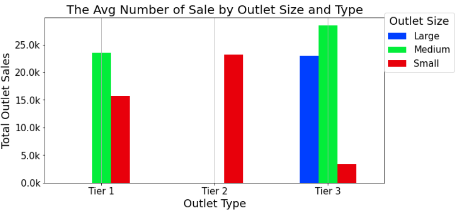

# Sale Prediction
## MakIng sale prediction based on different  features

**Guy Lozius**: 

### Business problem:

The goal of this is to help the retailer understand the properties of products and outlets that play crucial roles in increasing sales.

### Data:

Dataset source: (https://drive.google.com/file/d/1syH81TVrbBsdymLT_jl2JIf6IjPXtSQw/view)
####The Features of Dataset
| Item\_Identifier            | Unique product ID                                                                                   |
| --------------------------- | --------------------------------------------------------------------------------------------------- |
| Item\_Weight                | Weight of product                                                                                   |
| Item\_Fat\_Content          | Whether the product is low fat or regular                                                           |
| Item\_Visibility            | The percentage of total display area of all products in a store allocated to the particular product |
| Item\_Type                  | The category to which the product belongs                                                           |
| Item\_MRP                   | Maximum Retail Price (list price) of the product                                                    |
| Outlet\_Identifier          | Unique store ID                                                                                     |
| Outlet\_Establishment\_Year | The year in which store was established                                                             |
| Outlet\_Size                | The size of the store in terms of ground area covered                                               |
| Outlet\_Location\_Type      | The type of area in which the store is located                                                      |
| Outlet\_Type                | Whether the outlet is a grocery store or some sort of supermarket                                   |
| Item\_Outlet\_Sales         | Sales of the product in the particular store. This is the target variable to be predicted.          |

## Methods
- Import Data
-Look for duplicate data and missing value
-Delete duplicate data so the results can be better generalize to the full dataset
-Find inconsistent and outliers then fix them
-Handling missing data by impute based on a pattern and dropping some rows because there were no pattern on the missing data. 
-Visualizing Data
- create a heatmap to see the correlation of different features
-create bar graph and histogram to see trends and to see distribution of data
- Creating Model
- import dataset and make a copy
-check for duplicate data and missing data
-delete duplicate so the model can better generalize to the full dataset.
- Assigning Item_Outlet_Sales as our target variable because what we will be predicting 
-Assigning Outlet_Size, Item_Type, Outlet_Location_Type, and  Outlet_Type as our features based on relevance.
- Split Feature and Target variable  into training set and Testing set, for no data leakage.
- Impute missing value with mean and most frequent to maintain the completeness in a dataset
- Scaling data with either standard scale or one hot encoder
- Fit our models on training for no data leakage
-Evaluate our models 
-Then determine which model will be recommended based on evaluation.

## Results

#### The Avg Number of Sale by Outlet Size and Type

> This chart show the different in sales by Outlet Size and we see that there no pattern

#### The Average Sales Per Item Type

>This graph show average basic on item type

## Model

Describe your final model
Our first Model is a linear regression model that uses a regression line to predict target variables.
Our second model is DecisionTreeRegressor that uses a series of questions designed to predict our target variable .

To evaluate how well our model predicts our target we use R2  because it explains how much different the outcome is explained by our model.

Refer to the metrics to describe how well the model would solve the business problem
## Recommendations:
I decided to use a linear regression model to predict because it has lowest variance and lowest Bias on the test set.

## Limitations & Next Steps
For the model to be better I would need data, features, or both so the model would not be underfitting.

### For further information

For any additional questions, please contact **llozius@gmail.com**
